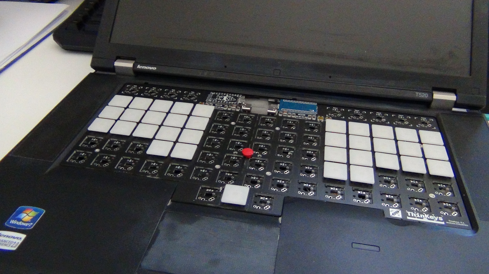
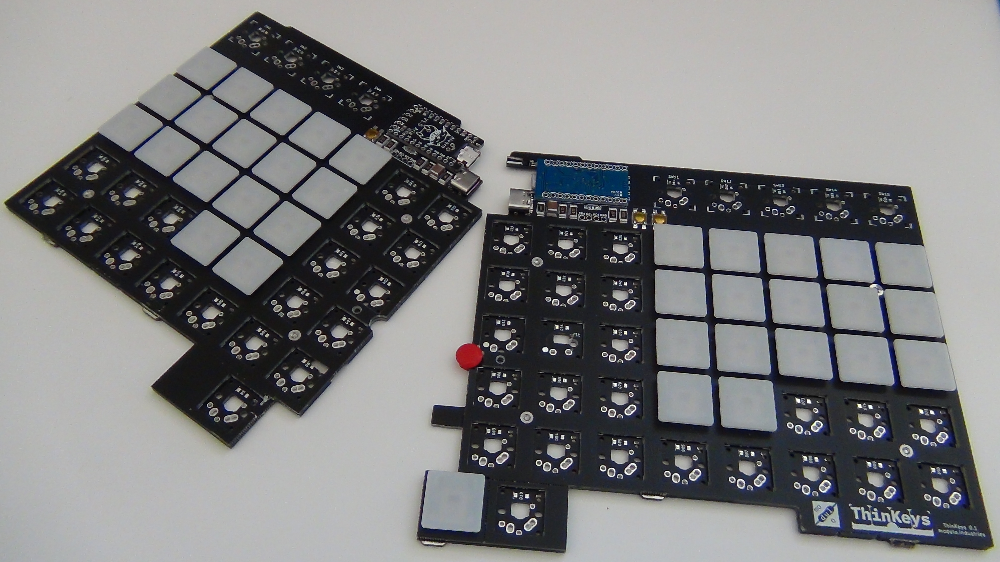

View this project on [CADLAB.io](https://cadlab.io/project/24445). 

ThinKeys
========
Split ortholinear custom replacement keyboard with TrackPoint for ThinkPad laptops.

Layout can be mapped as desired with QMK.

Other physical layouts will be offered if there is enough demand for them.

Videos
------
- [Playlist (YouTube)](https://www.youtube.com/playlist?list=PLA83yaoqEOKUAF3hhw5IN6eBIaD0fTjDs)

Compatibility
-------------
The first model is for Lenovo ThinkPads T410-T430, T510-T530, W510-W530, and
X220-X230 (including s, i, and t suffixed variants).

Later model support planned for X230s-X270, T431s-T450s/T440(p)-T460(p) and
beyond.

Goals
-----
- [X] TrackPoint
- [X] Split for external/desktop use (connect via USB Type-C)
- [X] Ortholinear
- [ ] ~~RGB LED Backlight (ThinkLight infeasible)~~ No backlight in the first
      version, maybe next time
- [X] USB Connection
- [X] Power Button
- [X] Socketable Pro Micro (or compatible)

Chat
----
Join via Matrix: https://matrix.to/#/!igsJfJkAlUganwyDzE:librem.one?via=librem.one

Join via Discord: https://discord.gg/MA2DBqRyEK

Low Profile Keyboards Discord: https://discord.gg/yhGEvATCFs

Pineapples
----------
Inspiration and some design from https://github.com/saoto28/pineapple60

Older models like xx20/xx30 have a lot more keyboard thickness (height?) than
newer ones like T460s/T470s, so lid closing clearance is not expected be an
issue.
