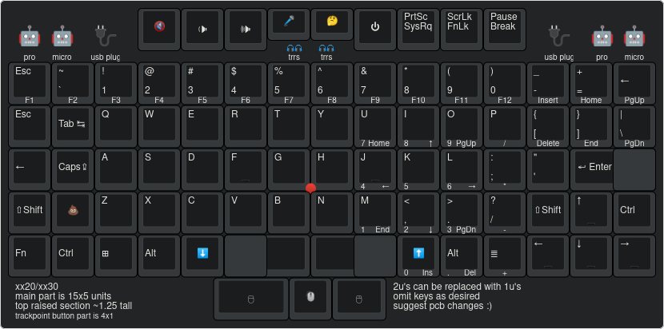
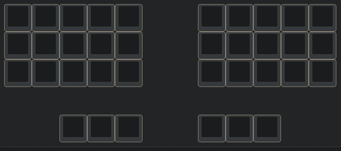

ThinKeys
========
A work-in-progress custom mechanical keyboard to replace laptop keyboard.

Figure 1: ThinKeys 23 reference layout design. Planning to offer other layout
for those who don't want ortho.

Figure 2: With ortholinear layout, it is easy to use the same PCB but omit keys
selectively for different layout. Someone in the chatroom suggested this one.

Compatibility
-------------
The first model, ThinKeys 23, will be for xx20 and xx30 series ThinkPads:
- X220
- X220T
- X230
- X230T
- T420
- T420s
- T430
- T430s
- T520
- T530
- W520
- W530

Later model support will come for X240-X270, T440/T440s/T440p-T450s/T460/T460p
and beyond.

Goals
-----
- [ ] TrackPoint
- [ ] Split for external/desktop use (connect via TRRS)
- [ ] Ortholinear
- [ ] RGB LED Backlight
- [ ] USB Connection (Internal via BDC/SmartCard, or external for desktop use)
- [ ] Power Button
- [ ] Socketed Pro Micro

Chat
----
ThinKeys project has a chatroom.

Join via Matrix: https://matrix.to/#/!igsJfJkAlUganwyDzE:librem.one?via=librem.one

Join via Discord: coming soon

Pineapples
----------
Inspiration and some design from https://github.com/saoto23/pineapple60

Older xx20/xx30 models have a lot more keyboard space than T460s/T470s, so
lid closing clearance won't be an issue.
