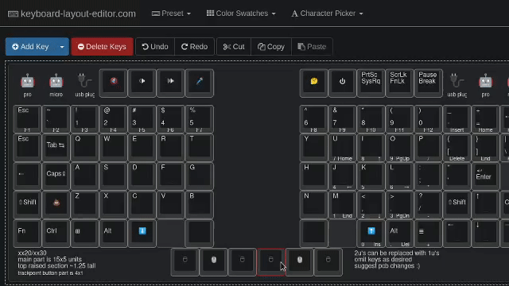

ThinKeys
========
Work-in-progress custom mechanical keyboard to replace laptop keyboard.

Figure 1: Reference layout design.

Figure 2: With ortholinear layout, it is easy to use the same PCB but omit keys
selectively for different layout. Someone in the chatroom suggested this one.

Figure 3: In this example, I chose to have the left TrackPoint button attached
to the left half and the others attached to the right half using PCB
breakaways. Then the split halves can be pushed together to fit in the laptop.
For only desktop use, one might choose to keep all 6 thumb keys.

Layout can be mapped as desired with QMK.

Planning to offer other layout in the future for those who don't want ortho.

Videos
------
- Using Kailh X switch: [Info](https://www.youtube.com/watch?v=VLaw7yDKOLo)
- [Introduction to the ThinKeys Project](https://www.youtube.com/watch?v=Vvx_2N7dB2o)

Compatibility
-------------
The first model will be for X-series, T-series, and W-series xx20/xx30 Lenovo
ThinkPads.

Later model support planned for X230s-X270, T431s-T450s/T440(p)-T460(p) and
beyond.

Goals
-----
- [X] TrackPoint
- [X] Split for external/desktop use (connect via TRRS)
- [X] Ortholinear
- [ ] ~~RGB LED Backlight (ThinkLight infeasible)~~ No backlight in the first
      version, maybe next time
- [X] USB Connection (Internal via [ThinkMods](https://thinkmods.store/)
      Bluetooth/SmartCard adapters, or external for desktop use)
- [X] Power Button
- [X] Socketable Pro Micro (or compatible)

Chat
----
Join via Matrix: https://matrix.to/#/!igsJfJkAlUganwyDzE:librem.one?via=librem.one

Join via Discord: https://discord.gg/MA2DBqRyEK

Pineapples
----------
Inspiration and some design from https://github.com/saoto28/pineapple60

Older models like xx20/xx30 have a lot more keyboard thickness (height?) than
newer ones like T460s/T470s, so lid closing clearance is not expected be an
issue.
